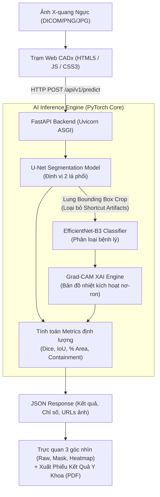

# 🫁 Chest X-Ray CADx: Segmentation & Diagnosis of COVID-19 and Lung Opacity

[](https://fastapi.tiangolo.com)
[](https://pytorch.org/)
[](https://www.docker.com/)
[](https://ubuntu.com/)
[](https://opensource.org/licenses/MIT)

> **Hệ thống hỗ trợ chẩn đoán hình ảnh X-quang phổi (Computer-Aided Diagnosis - CADx)** ứng dụng mô hình học sâu **EfficientNet-B3**, **U-Net** và kỹ thuật giải thích mô hình **Grad-CAM (Explainable AI - XAI)** nhằm phân loại tổn thương phổi (*COVID-19, Lung Opacity, Normal*), khoanh vùng giải phẫu nhu mô phổi và kiểm soát hiện tượng *Shortcut Learning*.

---

## 🌟 Tính Năng Nổi Bật

- **🩺 Trạm chẩn đoán chuyên dụng (Clinical CADx Workstation):** Giao diện web chuẩn phòng đọc X-quang (Dark theme, tối ưu trải nghiệm bác sĩ, không emoji, tương thích mọi thiết bị).
- **🔬 Pipeline AI Đa Nhiệm (Multi-task AI Pipeline):**
  - **Phân loại tổn thương (Classification):** Sử dụng mạng nơ-ron tích chập sâu `EfficientNet-B3` nhận diện 3 nhóm: *COVID-19 (Tổn thương đông đặc), Mờ phổi / Giảm thông khí (Lung Opacity), Phổi bình thường (Normal)*.
  - **Phân đoạn nhu mô phổi (Segmentation):** Mô hình `U-Net` tự động khoanh vùng chính xác 2 lá phổi (Val Dice: **0.9862**).
  - **Giải thích quyết định (Explainable AI - Grad-CAM):** Trực quan hóa bản đồ nhiệt kích hoạt nơ-ron, giúp bác sĩ kiểm chứng vùng tổn thương thực tế.
  - **Kiểm soát Shortcut Learning:** Tích hợp cơ chế cắt ảnh theo khung phổi (Lung Bounding Box Crop) để loại bỏ nhiễu ngoài rìa (chữ ký, thước đo, watermark).
- **📊 Bảng chỉ số định lượng kỹ thuật (Quantitative Metrics):** Cung cấp đồng thời *Dice Coefficient, IoU, Macro Precision, Macro Recall, Tỷ lệ diện tích tổn thương (% Lung Area), Thời gian suy luận (Inference Time)*.
- **📄 Xuất / In Phiếu Kết Quả Y Khoa (PDF Medical Report):** Tự động tạo báo cáo kết quả chẩn đoán y tế chuẩn bệnh viện (chứa mã ca chụp, 3 ảnh trực quan, bảng chỉ số và khung chữ ký bác sĩ) để in ra giấy hoặc lưu trữ PDF.
- **🔒 Kiến trúc bảo mật Privacy-First (Zero Data Retention):** Suy luận trực tiếp trong bộ nhớ RAM, không lưu trữ hồ sơ bệnh nhân công khai nhằm bảo mật tuyệt đối dữ liệu y tế theo chuẩn HIPAA.

---

## 🏛️ Kiến Trúc Hệ Thống (System Architecture)



---

## 📁 Cấu Trúc Thư Mục Dự Án

```text
Chest-X-ray-CADx/
├── backend/                         # Backend FastAPI & Web Workstation
│   ├── app/
│   │   ├── core/                    # Cấu hình đường dẫn, hằng số, sys.path
│   │   ├── routers/                 # REST API Endpoints (/predict, /samples, /health)
│   │   ├── schemas/                 # Pydantic Schemas định nghĩa Request/Response
│   │   ├── services/                # ai_engine.py (Tích hợp PyTorch, U-Net, Grad-CAM)
│   │   └── main.py                  # Điểm khởi động ứng dụng FastAPI & Mount Static
│   ├── frontend/                    # Giao diện CADx Web (index.html, samples)
│   ├── uploads/                     # Thư mục chứa ảnh xử lý tạm thời (.gitkeep)
│   └── requirements.txt             # Danh sách thư viện Python cho Backend & AI Serving
├── src/                             # Mã nguồn huấn luyện & tiền xử lý dữ liệu
│   ├── dataset.py                   # PyTorch Dataset, Data Augmentations, Crop logic
│   ├── gradcam.py                   # Thuật toán Grad-CAM Heatmap Overlay
│   ├── model.py                     # Cấu trúc mạng EfficientNet-B3 Classifier
│   ├── unet.py                      # Cấu trúc mạng U-Net Lung Segmentation
│   ├── shortcut_iou.py              # Đánh giá IoU, Containment, kiểm định Shortcut Learning
│   ├── preprocess.py                # Tiền xử lý dữ liệu gốc
│   └── split_data.py                # Phân chia tập Train / Val / Test
├── weights/                         # Trọng số mô hình đã huấn luyện (.pth)
│   ├── best_classifier_cropped.pth  # Mô hình phân loại tối ưu (Crop Mask)
│   ├── best_classifier.pth          # Mô hình phân loại Baseline
│   └── best_unet.pth                # Mô hình phân đoạn phổi U-Net
├── docs/                            # Tài liệu báo cáo, lý thuyết và hướng dẫn
├── Dockerfile                       # File đóng gói Docker Image (PyTorch CPU Optimized)
├── .dockerignore                    # Danh sách loại trừ khi build Docker
└── README.md                        # Tài liệu hướng dẫn dự án
```

---

## 📊 Kết Quả Huấn Luyện & Đánh Giá

| Mô hình | Nhiệm vụ | Tập kiểm thử (Val/Test) | Chỉ số đạt được |
| :--- | :--- | :---: | :--- |
| **U-Net** | Phân đoạn nhu mô phổi | Validation Set | **Dice Score: `0.9862`** \| **IoU: `0.9728`** |
| **EfficientNet-B3 (Baseline)** | Phân loại 3 lớp | Validation Set | **Macro F1: `0.9057`** \| **Accuracy: `91.2%`** |
| **EfficientNet-B3 (Crop Mask)** | Phân loại tối ưu chống Shortcut | Validation Set | **Macro Precision: `93.22%`** \| **Macro Recall: `93.04%`** |

---

## 🚀 Hướng Dẫn Cài Đặt & Chạy Ứng Dụng

### Cách 1: Chạy trực tiếp trên máy Local

#### 1. Khởi tạo môi trường Python:
```bash
# Clone repository
git clone https://github.com/thang2608/Chest-X-ray-Segmentation-and-Diagnosis-of-Pneumonia-and-COVID-19.git
cd Chest-X-ray-Segmentation-and-Diagnosis-of-Pneumonia-and-COVID-19

# Cài đặt các thư viện phụ thuộc
pip install -r backend/requirements.txt
```

#### 2. Khởi động Web Server:
```bash
cd backend
uvicorn app.main:app --reload --port 8000
```
Truy cập giao diện Web tại: **`http://localhost:8000`**  
Xem tài liệu Swagger API tại: **`http://localhost:8000/docs`**

---

### Cách 2: Triển khai bằng Docker

```bash
# 1. Build Docker Image (Bản PyTorch CPU siêu nhẹ ~200MB)
docker build -t chest-cadx-app .

# 2. Khởi chạy Container
docker run -d -p 8000:8000 --name chest-cadx chest-cadx-app
```
Truy cập: **`http://localhost:8000`**

---

### Cách 3: Triển khai Production trên VPS (DigitalOcean / Ubuntu Server)

```bash
# 1. Đăng nhập vào VPS
ssh root@<IP_VPS>

# 2. Cài đặt Docker
curl -fsSL https://get.docker.com | sh

# 3. Clone code và khởi chạy cổng 80 (hoặc qua Nginx HTTPS)
git clone https://github.com/thang2608/Chest-X-ray-Segmentation-and-Diagnosis-of-Pneumonia-and-COVID-19.git
cd Chest-X-ray-Segmentation-and-Diagnosis-of-Pneumonia-and-COVID-19
docker build -t chest-cadx-app .
docker run -d -p 80:8000 --restart always --name chest-cadx chest-cadx-app
```

---

## 👥 Thành Viên Thực Hiện

| Họ và Tên | Vai trò / Trách nhiệm chính |
| :--- | :--- |
| **Đỗ Đức Duy Thắng** | Backend & Deployment |
| **Đoàn Nhất Minh** | Model Lead |
| **Nguyễn Bảo Tiên** | Frontend & Demo |
| **Võ Lê Phúc Thịnh** | Evaluation & Report |
| **Lê Nguyễn Minh Khôi** | Data Engineering |

* **👨‍🏫 Mentor hướng dẫn:** Chu Minh Nguyên
* **🏛️ Đơn vị:** Machine Learning & IoT Lab (HCMUT - EE)

---

## 📜 Giấy Phép & Khuyến Cáo Y Tế

- **Bản quyền:** Mã nguồn được phát hành dưới giấy phép [MIT License](LICENSE).
- **Khuyến cáo y khoa (Medical Disclaimer):** Hệ thống được phát triển phục vụ mục đích nghiên cứu khoa học và hỗ trợ sàng lọc sơ bộ. Kết quả dự đoán từ mô hình AI không thay thế cho kết luận chẩn đoán chính thức từ bác sĩ chuyên khoa.
